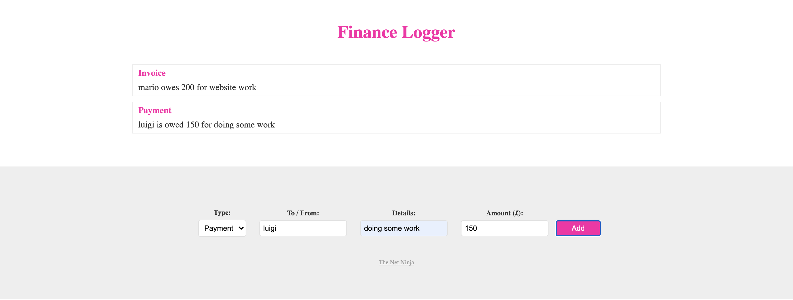

# TypeScript Tutorial

This is the [TypeScript Tutorial Project](https://honmetha.github.io/typescript-tutorial/public/index.html) that I learnt from [The Net Ninja](https://www.youtube.com/watch?v=2pZmKW9-I_k&list=PL4cUxeGkcC9gUgr39Q_yD6v-bSyMwKPUI).

## Tutorials

1. Introduction & Setup
1. Compiling TypeScript
1. Type Basics
1. Objects & Arrays
1. Explicit Types
1. Dynamic (any) Types
1. Better Workflow & tsconfig
1. Function Basics
1. Type Aliases
1. Function Signatures
1. The DOM & Type Casting
1. Classes
1. Public, Private & Readonly
1. ModulesFeatures
1. Interfaces
1. Interfaces with Classes
1. Rendering an HTML Template
1. Generics
1. Enums
1. Tuples
1. Wrap Up
